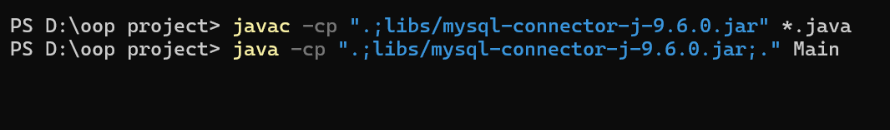
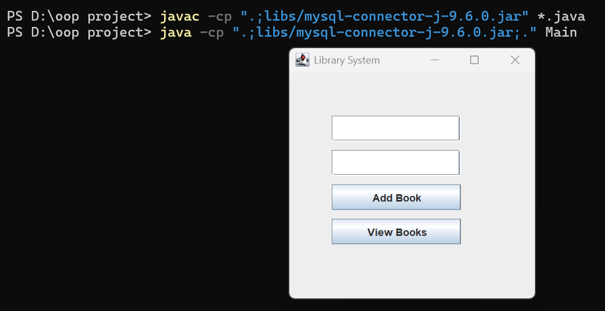
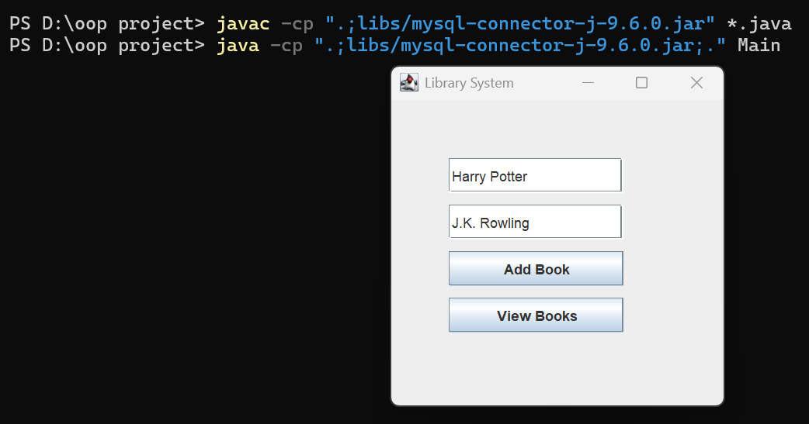
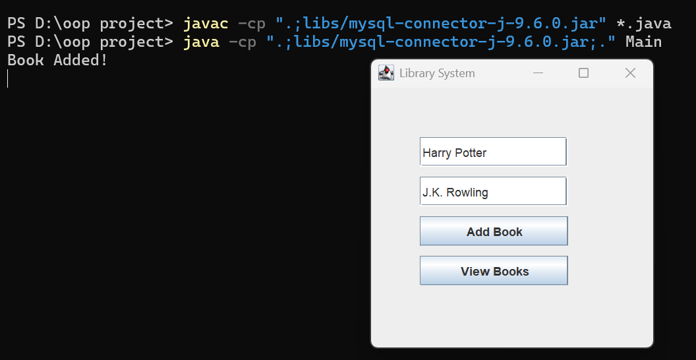
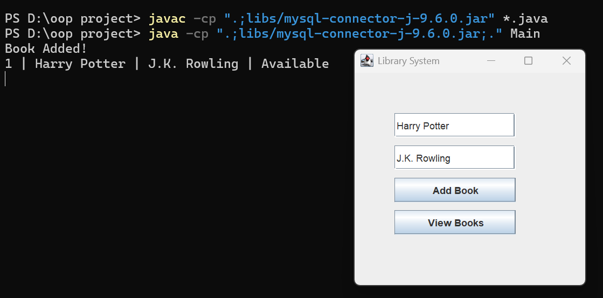
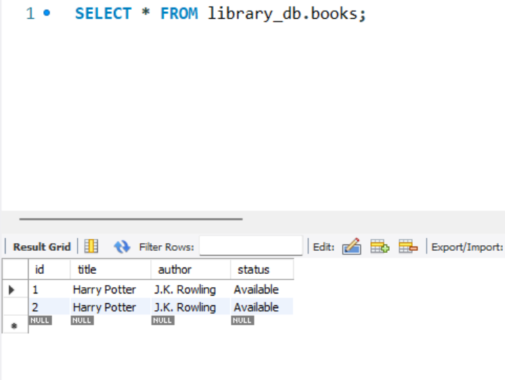

# 📚 Library Management System (OOP Project)

## 📌 Project Description
This Library Management System is a Java-based desktop application developed using Object-Oriented Programming (OOP) concepts and MySQL database. It allows users to manage books through a graphical user interface (GUI), including adding and viewing books with permanent data storage in a database.

This project was developed as a semester assignment for the Object-Oriented Programming (OOP) course to demonstrate real-world application development using Java and MySQL.

---

## 📝 Project Overview
This project demonstrates how Java can be used to build real-world applications by combining GUI development and database connectivity. The system helps users manage library books in an organized and efficient way.

---

## 🎯 Purpose of the Project
The purpose of this project is to:
- Apply OOP concepts in a real-world application  
- Understand Java and MySQL integration  
- Learn structured software design  
- Build a GUI-based management system  
- Simulate a real library system  

---

## ⚙️ Working of System
Users can add new books using a GUI interface. The data is stored in a MySQL database using JDBC. Users can also view all stored books, which are retrieved from the database and displayed in the application.

---

## 👩‍💻 Group Members

| Name | CMS ID |
|------|--------|
| Anam Mairaj | 023-25-0536 |
| Sidra-tul-Muntaha | 023-25-0516 |
| Inshrah Batool | 023-25-0528|
| Fatima Raza | 023-25-0525 |

---

## 🏗️ Core Modules (System Design)

### 📦 Model Layer
- Book → Represents book entity (id, title, author, status)

### 🗄️ Database Layer
- DBConnection → Handles MySQL connection using JDBC

### ⚙️ Service Layer
- LibraryManager → Contains logic (add, view, issue, return books)

### 📋 Interface Layer
- LibraryOperations → Defines system operations

### 🖥️ UI Layer
- LibraryGUI → Java Swing-based user interface

### 🚀 Main Class
- Main → Entry point of application

---

## 🧠 OOP Concepts Used
- Classes and Objects  
- Encapsulation (private variables + getters/setters)  
- Abstraction (database logic hidden in DB class)  
- Interfaces (LibraryOperations)  
- Polymorphism (method overloading/implementation)  
- Exception Handling  
- Modular layered architecture  

---

## ⚙️ Technologies Used
- Java (OOP Concepts)  
- Java Swing (GUI)  
- MySQL Database  
- JDBC Connectivity  

---
## 🚀 How to Run the Project

### 1. Requirements
- Java Development Kit (JDK 25 - OpenJDK 25.0.1 LTS)  
- MySQL Workbench (for database setup)  
- Sublime Text (code editor)  
- MySQL Connector JAR (for JDBC connection)

---

## 🚀 Database Setup

```sql
CREATE DATABASE library_db;

CREATE TABLE books (
    id INT AUTO_INCREMENT PRIMARY KEY,
    title VARCHAR(100),
    author VARCHAR(100),
    status VARCHAR(20)
);
```

## 📸 Screenshots

### 1. Compilation & Running Project


### 2. Main Menu Screen


### 3. Enter Book Information


### 4. Add Book Operation


### 5. View Book Output


### 6. MySQL Database Table

---

## 📊 Database Info
- Database Name: `library_db`
- Table: `books`
---

### Example Table Data:
| id | title | author | status |
|----|------|--------|--------|
| 1 | Harry Potter | J.K. Rowling | Available |

---


## 📌 Project Features
- Add new books
- View all books
- Store data permanently in database
- Simple GUI interface

---

## 📦 Submission Includes
- Java source code (.java files)  
- MySQL database file (.sql)  
- README documentation  
- Screenshots (uploaded directly in repository)  
- PowerPoint Presentation (PPT)  
- GitHub repository link  
- Video demonstration link  
---

## 🎥 Project Video Demonstration

- The project video was created using a PowerPoint (PPT) presentation.
- Each group member explained their part in the video.

### 📌 Video Link:
👉 https://drive.google.com/file/d/1mKXslIjKkL-rwV57YXSJmM1sEnqLrtaF/view?usp=sharing

---

## 📂 GitHub Repository
👉 https://github.com/anammairaj/Library-Management-System

## 🎯 Conclusion
This project successfully demonstrates the integration of Java OOP concepts with MySQL database connectivity to build a functional Library Management System. It helped us understand real-world application development including GUI design, database handling, and object-oriented programming concepts.


